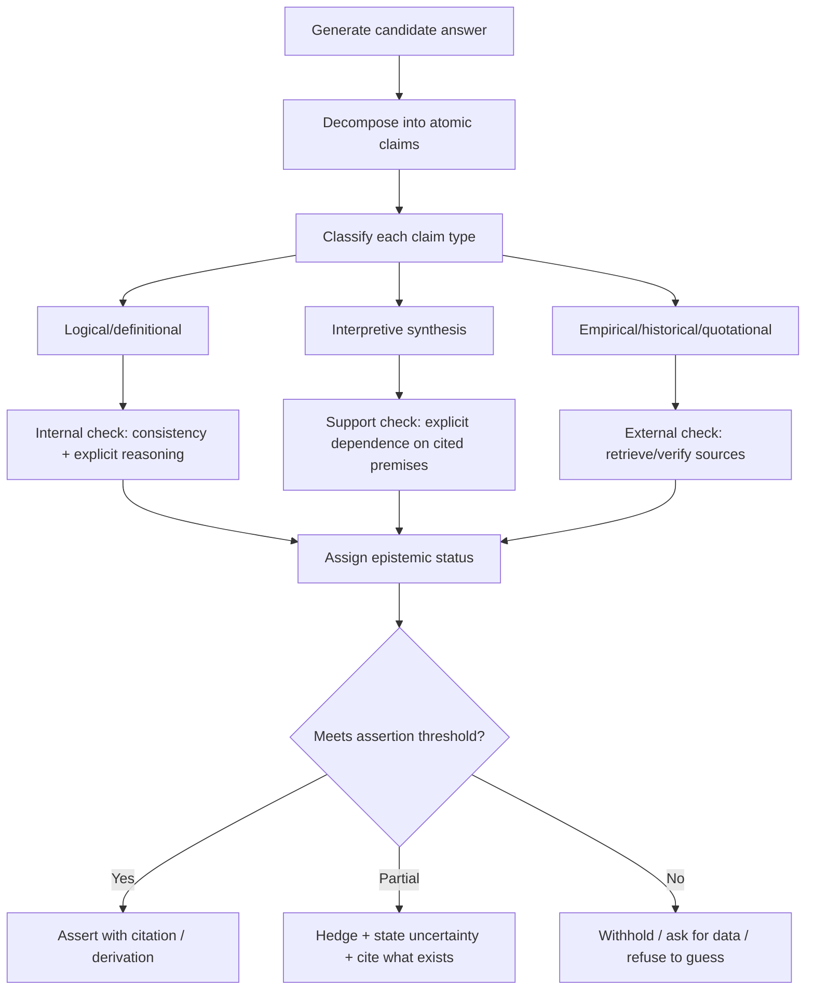

# Cartesian Method and the Boundary Between Knowledge and Illusion

## Executive summary

Descartes’ “Cartesian method” is best understood as a disciplined procedure for separating *what can be known with epistemic security* from what might be *illusory* (mistaken, dreamt, or systematically deceived). In entity["book","Meditations on First Philosophy","1641"], he introduces **methodic doubt**: suspend assent to any belief that is not “entirely certain and indubitable,” and do so *structurally* by attacking the “foundations” of whole classes of belief (sense-based beliefs, memory, reasoning) rather than checking each belief one by one. citeturn16view0turn24view2

The procedure yields an initial “fixed point” of certainty: the **cogito** (in a standard Meditations formulation: “I am, I exist … whenever I think”). This is intended as knowledge immune to the dream and deception hypotheses because even a deceiver cannot make it false *while it is being thought*. citeturn17view0turn14view2 From that fixed point, Descartes articulates a **clarity-and-distinctness** criterion (very roughly: what is grasped “clearly and distinctly” is true) and then argues that a non-deceiving God is needed to stabilize that criterion against “metaphysical doubt” and to underwrite epistemic trust in our faculties over time (not merely *while attending*). citeturn18view0turn21view0turn14view2

In contemporary epistemology, many of Descartes’ specific theses—especially the *infallibilist* and *theological guarantee* components—are widely regarded as **revised rather than simply adopted**. Yet several core insights remain live and highly influential: (i) the idea of **explicit epistemic status** (assent vs suspension), (ii) the separation of **appearance from judgment** (illusion often enters at the level of *judging* beyond what is given), and (iii) a norm of **assertion-control** (Descartes’ “will” outrunning “intellect”) that maps directly onto modern reliability and “anti-hallucination” goals. citeturn21view0turn24view2turn4search1turn4search0

For building an AI skill to avoid hallucinations, the most operationalizable Cartesian idea is not “prove God,” but the *engineering analog* of Descartes’ epistemic safeguard: couple **internal clarity** (explicit, checkable representation of what is being claimed and why) with **external reliability constraints** (source-tracking, cross-checking, calibrated uncertainty, and refusal to assert beyond evidence). This aligns naturally with modern externalist approaches (e.g., process reliabilism), virtue-theoretic “competence” approaches, modal “safety” approaches, and Bayesian/abductive treatments of skeptical hypotheses. citeturn4search1turn4search2turn5search0turn10search0turn4search3

## Primary sources and authoritative English translations

Descartes’ epistemology is developed across three canonical texts:

- entity["book","Discourse on the Method","1637"] (method rules; the cogito in autobiographical/methodological form; early metaphysical sketch). citeturn15view1turn14view2  
- entity["book","Meditations on First Philosophy","1641"] (the systematic enactment of methodic doubt and reconstruction of certainty). citeturn16view0turn17view0turn18view0turn22view0  
- entity["book","Principles of Philosophy","1644"] (a “textbook” synthesis; explicit definitions of clarity/distinctness and the role of doubt; metaphysics as “roots” of the sciences). citeturn23view0turn24view2

### Referencing conventions used in rigorous scholarship

Most English-language scholarship cites Descartes with **Adam & Tannery** volume/page numbers (“AT”) and, for English, the **Cottingham–Stoothoff–Murdoch** translation (“CSM”; sometimes with Kenny as “CSMK” for correspondence). The entity["organization","Stanford Encyclopedia of Philosophy","online encyclopedia, stanford"] notes this as a standard practice in Descartes scholarship. citeturn3search27turn9search22

### Authoritative English translations

Authoritative modern teaching-and-research translations commonly include:

- entity["book_series","The Philosophical Writings of Descartes","cottingham trans 1984-1991"], translated by entity["people","John Cottingham","philosopher, translator"], entity["people","Robert Stoothoff","translator"], entity["people","Dugald Murdoch","translator"] (and for vol. III also entity["people","Anthony Kenny","philosopher, translator"]). This multi-volume set is widely treated as a default scholarly English translation. citeturn3search31turn3search27turn3search15  
- The Cambridge dual-language edition of the *Meditations* featuring Cottingham’s translation (useful for Latin/English study). citeturn2search26  
- entity["organization","Hackett Publishing Company","publisher, indianapolis, in"] editions translated by entity["people","Donald A. Cress","philosopher, translator"] (widely used in North American classrooms; explicitly positioned as a revised translation keyed to critical editions). citeturn3search8turn3search24turn3search28  
- entity["organization","Oxford University Press","publisher, oxford, uk"] editions: *Meditations* translated by entity["people","Michael Moriarty","translator, oxford"] and *Discourse* translated by entity["people","Ian Maclean","renaissance scholar, translator"]. citeturn3search1turn3search10turn3search30

### Open-access primary texts used for quotations in this report

Because the request includes “links to open-access papers,” this report anchors direct quotations in public-domain English translations hosted by entity["organization","Project Gutenberg","ebook library"] and entity["organization","Wikisource","wikimedia library"]. (These are convenient and citable, but do not replace critical editions for scholarly publication.) citeturn15view1turn21view0turn24view2turn13view0

## Key concepts and definitions with primary-text anchors

### Methodic doubt

**Definition.** *Methodic doubt* is a deliberate stance of withholding assent from any belief that admits “the slightest doubt,” undertaken as a methodological tool for discovering foundations secure enough to support knowledge. It is not merely “being skeptical,” but a controlled epistemic strategy: doubt is used instrumentally to locate what survives the strongest feasible error-hypotheses. citeturn16view0turn24view2turn9search22

**Primary evidence.** In *Meditation I*, Descartes frames the project as rebuilding “from the foundation,” rejecting beliefs not “entirely certain and indubitable,” and he emphasizes that undermining foundations topples the system. citeturn16view0 In *Principles* (Part I), the method is restated as something to do “once in the course of our life” to overcome childhood “prejudices,” doubting anything with even the “smallest suspicion of uncertainty.” citeturn24view2

**Illusion-target.** The method is designed to filter out beliefs vulnerable to: sensory error, the dream scenario, and more radical “global deception” scenarios (evil demon / deceiving-God style). citeturn16view0turn5search2

### Cogito

**Definition.** The **cogito** is the claim that *one’s existence (as a thinking being) is certain whenever one is thinking*—because doubting, being deceived, or even entertaining skepticism presupposes that there is thinking occurring (and, for Descartes, a thinker). citeturn17view0turn14view2

**Primary evidence.** In *Meditation II*: “I am, I exist… is necessarily true each time it is expressed… or conceived in my mind.” citeturn17view0 In *Discourse* (Part IV), Descartes presents “I think, therefore I am” as the “first principle” immune to skeptical challenge. citeturn14view2

**Illusion-target.** Even if dreaming or deceived by an “evil genius,” existence is secured *in the act* of being deceived or thinking. citeturn17view0turn16view0

### Clear and distinct perceptions

**Definition.** A perception is **clear** when it is “present and manifest to the attentive mind,” and **distinct** when it is “precise and different from all other objects” so it contains only what is clear. citeturn24view2

**Primary evidence.**  
- *Meditation III* introduces the “general rule”: “all that is very clearly and distinctly apprehended is true.” citeturn18view0  
- *Principles* provides the classical definitions of *clear* and *distinct* and the normative rule that we avoid error by assenting only to what is clearly and distinctly perceived. citeturn24view2

**Illusion-target.** Descartes distinguishes (i) the psychological vividness of sensory impressions from (ii) the epistemic security of a clear-and-distinct intellectual grasp. The risky step is often *judging beyond what is given*—e.g., taking an idea as resembling external things. citeturn18view0turn22view0turn24view2

### Foundationalism

**Definition.** In epistemology, **foundationalism** is the view that justified belief/knowledge has a “foundation” of non-inferentially justified items and a “superstructure” supported by them. Descartes is a paradigm “foundationalist inspiration” in later epistemology. citeturn7search0turn7search3turn7search30

**Primary evidence.** Descartes repeatedly uses building/foundation imagery: rebuild “from the foundation” in *Meditation I*; and in the *Principles* preface-letter he explicitly describes principles that (i) are indubitable and (ii) ground knowledge of other truths. citeturn16view0turn23view0

**Contemporary framing.** Modern treatments contrast foundationalism with coherentism and infinitism, often using Descartes as the canonical “pyramid” model. citeturn7search0turn7search30

### Mind–body dualism

**Definition.** **Mind–body dualism** (Cartesian substance dualism) is the thesis that mind and body are really distinct substances, with mind characterized by thought and body by extension. citeturn22view0turn24view2turn8search1turn8search8

**Primary evidence.** In *Meditation VI*, Descartes argues that since he has a clear and distinct idea of himself as “thinking and unextended” and of body as “extended and unthinking,” mind is “entirely and truly distinct” from body and can exist without it. citeturn22view0 In *Principles*, he articulates thought and extension as constituting the nature of mind and body and emphasizes clear-and-distinct cognition of each when attributes are properly distinguished. citeturn24view0turn24view2

### God’s role in epistemic certainty

**Definition.** For Descartes, God’s epistemic function is to secure **metaphysical certainty**: if God exists and is not a deceiver, then the faculty of clear-and-distinct perception (properly used) is truth-conducive; this is intended to dissolve the residual worry that a powerful deceiver could make even the clearest reasoning false. citeturn18view0turn21view0turn14view2

**Primary evidence.**  
- In *Meditation III*, after proposing the clarity-and-distinctness rule, Descartes claims he must establish that God exists and is not a deceiver to be “certain of anything” against metaphysical doubt. citeturn18view0  
- In *Meditation IV*, he argues God cannot deceive and explains human error via misuse of faculties (will exceeding intellect), concluding that clear-and-distinct judgment is true partly because God is no deceiver. citeturn21view0  
- In *Discourse*, he states that the “rule” that what we clearly and distinctly conceive is true is “certain only because God exists” and is perfect (a formulation central to later “Cartesian Circle” objections). citeturn14view2

## Cartesian method as a procedure for securing knowledge

Descartes’ method is not only the *act of doubting*; it is a full *epistemic workflow* with (i) a demolition phase, (ii) a foundation phase, and (iii) a reconstruction phase. The workflow combines the hyperbolic doubts of the *Meditations* with the “four rules” for inquiry described in the *Discourse* and the textbook-style articulation in the *Principles*. citeturn16view0turn15view1turn24view2

### The procedure, step-by-step

**Step: Explicitly set an acceptance rule (assent-control).**  
Descartes’ baseline norm is: do not accept as true what you do not “clearly know,” to avoid “precipitancy and prejudice.” citeturn15view1 This is the earliest form of the later “restrict assent to clear and distinct perception” rule. citeturn24view2turn21view0

**Step: Apply systematic doubt to belief-sources, not isolated beliefs.**  
He proposes rejecting beliefs whenever he finds “some ground for doubt,” and he notes that undermining the foundation collapses the “edifice.” citeturn16view0turn24view2 This is a *structural efficiency principle*: don’t test every belief; test the reliability of its generating source/class.

**Step: Run escalating “illusion tests.”**  
Descending layers of doubt in *Meditation I* function like adversarial test cases:  
- Senses sometimes mislead. citeturn16view0turn24view2  
- Dream possibility undermines ordinary perceptual certainty. citeturn16view0turn22view0  
- The evil demon hypothesis models systematic deception (a precursor to modern brain-in-a-vat scenarios). citeturn16view0turn5search2

**Step: Identify what survives the strongest doubt.**  
The cogito emerges because deception and doubt themselves entail thought and thus existence “each time” it is conceived. citeturn17view0turn14view2

**Step: Extract a criterion from the paradigm case.**  
In *Meditation III*, Descartes explicitly asks what made the cogito certain and answers: it was the “clear and distinct perception” of what he was asserting, proposing the “general rule” that what is clearly and distinctly apprehended is true. citeturn18view0turn24view2

**Step: Address the meta-skeptical threat to the criterion.**  
Descartes’ own worry: if it could “ever happen” that what is clearly and distinctly perceived is false (because of a deceiving God or defective faculties), the rule isn’t stable. Hence the move to God’s existence/non-deceptiveness and the associated “metaphysical” certainty. citeturn18view0turn21view0turn9search22

**Step: Reconstruct knowledge using “analysis → synthesis” discipline.**  
The *Discourse* describes four method rules: accept only what is clear; divide difficulties; move from simple to complex; check completeness by review/enumeration. citeturn15view1 This procedural “micro-method” is what turns foundational certainty into a potentially expansive body of knowledge.

**Step: Explain error as “asserting beyond evidence.”**  
In *Meditation IV* and *Principles*, error is traced to the mismatch between limited understanding and wide-ranging will; the remedy is to “restrain” judgment within clear-and-distinct cognition. citeturn21view0turn24view2 This is one of Descartes’ most directly operationalizable anti-illusion rules.

**Step: Re-admit mathematics, metaphysics, then the external world.**  
With the clarity-rule stabilized by God’s non-deception, Descartes aims to rehabilitate mathematics and then argue for the mind–body distinction and the existence of material things in *Meditation VI*. citeturn22view0turn21view0

### Flow diagram of the method

```mermaid
flowchart TD
  A[Set assent rule: accept only what is indubitable / clear & distinct] --> B[Demolition: doubt belief-sources]
  B --> C1[Test 1: sensory fallibility]
  B --> C2[Test 2: dream possibility]
  B --> C3[Test 3: global deception (evil demon)]
  C1 --> D[Hold assent in suspension where doubt applies]
  C2 --> D
  C3 --> D
  D --> E[Find indubitable: cogito (thinking -> existence)]
  E --> F[Extract criterion: clear & distinct perception]
  F --> G[Meta-check: could C&D be false?]
  G --> H[God exists & is non-deceiver (removes metaphysical doubt)]
  H --> I[Error theory: will outruns intellect; restrict judgment]
  I --> J[Reconstruction: build knowledge by analysis/synthesis + review]
  J --> K[Recover: math -> mind/body distinction -> external world (qualified)]
```

## Contemporary perspectives and the current status of Cartesian claims

This section treats each core Cartesian idea as a *claim family*, then summarizes (i) major contemporary critiques, (ii) defenses/revisions, and (iii) an evidence-based “status” label: **refuted** (in the strong Cartesian form), **contested**, or **revised**.

The contemporary landscape is shaped by debates over internal vs external justification, reliabilist versus evidentialist theories, virtue epistemology, modal conditions (sensitivity/safety), semantic externalism, contextualism, and Bayesian/abductive approaches to skeptical hypotheses. citeturn4search0turn4search1turn4search2turn4search7turn5search0turn4search3

### Comparison table

| Cartesian claim (core idea) | Primary anchor | Main contemporary objections | Notable defenses / revisions | Current status |
|---|---|---|---|---|
| Methodic doubt as the path to certainty | *Meditation I*; *Principles* I | Hyperbolic doubt is psychologically and practically unstable; “global” skepticism may be a philosophically generated artifact; doubt doesn’t entail skepticism about ordinary knowledge | Doubt as a *method* survives as epistemic humility, adversarial testing, and refusal norms; contextualist and pragmatic/hinge views reframe skepticism | **Revised** (method survives; “certainty-first” ideal contested) |
| Cogito as indubitable foundation | *Meditation II*; *Discourse* IV | “I” may be presupposed; at most “there is thinking”; doesn’t yet secure a robust self; infallible introspection challenged by externalism about content | Retained in minimal form: existence of conscious episodes is hard to deny; used as a starting point for internalist projects | **Revised/contested** (strong self-foundation contested) |
| Clear & distinct perceptions as a truth criterion | *Meditation III*; *Principles* XLIII–XLV | Subjective feel of clarity doesn’t guarantee truth; cognitive bias; the “Cartesian Circle” threatens circular validation of the criterion | Recast as defeasible justification (phenomenal conservatism, dogmatism) or as competence/reliability rather than “inner glow” | **Revised** (infallible criterion largely rejected) |
| Foundationalism (“pyramid”) | Building/foundation imagery | Regress problem doesn’t force infallible foundations; coherentism/infinitism alternatives; “basic” beliefs may be theory-laden | Fallible/modest foundationalism persists; some internalist revivalists defend a priori insight | **Contested** (infallibilist form largely rejected; modest forms live) |
| God as guarantor of epistemic certainty | *Meditation III–IV*; *Discourse* | Proofs of God contested; epistemic security needn’t be theological; “circle” objection (Arnauld) | Interpretations weaken the circle: present C&D yields “psychological certainty,” God stabilizes memory-based certainty; or epistemology without God | **Refuted/replaced** in mainstream analytic epistemology (still debated in historical scholarship) |
| Mind–body dualism (real distinction) | *Meditation VI*; *Principles* | Interaction problem; physicalist explanations; conceivability arguments debated | Dualism remains defended by some; distinction between mind and body as conceptual vs metaphysical is refined | **Contested** (not “settled” either way) |
| External world knowledge restored | *Meditation VI* | Skeptical hypotheses persist (BIV); closure principles generate paradox; representational gap concerns | Contextualism, relevant alternatives, Mooreanism, semantic externalism, disjunctivism, Bayesian abduction | **Contested/revised** (anti-skeptical strategies diversify) |

The table is grounded in Descartes’ own formulations in *Meditations*, *Discourse*, and *Principles* (for the left-hand column) citeturn16view0turn17view0turn18view0turn15view1turn24view2turn22view0 and in representative contemporary frameworks (SEP overviews of skepticism, foundationalism, internalism/externalism, reliabilism, virtue epistemology, Bayesian epistemology, and brain-in-a-vat skepticism). citeturn4search7turn7search0turn4search0turn4search1turn4search2turn4search3turn5search0

### Methodic doubt

**Core idea.** Descartes’ doubt is methodological: because false beliefs can contaminate the “superstructure,” he aims to remove anything not indubitable and rebuild. citeturn16view0turn24view2turn23view0

**Critiques.** Contemporary epistemology often questions whether “indubitability” is the right target. Skeptical arguments may trade on controversial principles (e.g., closure requirements, sensitivity conditions), and many approaches treat skepticism as showing limits of philosophical theorizing rather than a reason to deny ordinary knowledge. citeturn4search7turn6search2turn6search25

**Revisions/defenses.** A durable legacy is the *norm of suspended judgment*: do not assent beyond what your epistemic position supports. Modern “dogmatist” approaches (in the technical epistemological sense) argue for prima facie justification from experience without requiring prior refutation of skeptical hypotheses; this preserves everyday knowledge while conceding skeptical “possibilities.” citeturn6search0turn6search32turn6search36 Contextualism and relevant-alternatives approaches reinterpret skeptical pressure as context-sensitive (what counts as a “relevant alternative” shifts). citeturn6search25turn6search2turn6search15

**Status.** **Revised**: the *spirit* of doubt-as-discipline remains influential, but the *goal* of absolute certainty is widely contested rather than widely adopted. citeturn4search7turn7search3turn6search25

### Cogito

**Core idea.** The cogito is meant to be immune to deception because even being deceived entails existence as thinker. citeturn17view0turn14view2

**Critiques.** The most influential worries target (i) whether the inference presupposes a substantive “I,” and (ii) whether the cogito establishes more than the occurrence of thought. A second family of worries comes from externalism about mental content: if content depends partly on the environment, can one know *what* one is thinking while bracketing the external world? citeturn4search19turn4search34

**Revisions/defenses.** Even if one weakens the conclusion to something like “there is thinking now,” many philosophers accept that *some* first-personal certainty about current conscious episodes is unusually resilient. Contemporary virtue and reliabilist frameworks often treat self-knowledge as one domain within a broader account of reliable cognitive success, rather than as the unique foundation for all knowledge. citeturn4search2turn4search1

**Status.** **Revised/contested**: widely treated as capturing an important epistemic datum, but not as a complete foundation for all knowledge. citeturn9search22turn4search11

### Clear and distinct perceptions and the Cartesian Circle

**Core idea.** Descartes proposes that clear and distinct perception is the mark of truth, but also claims full certainty requires knowledge that God is non-deceptive. citeturn18view0turn14view2turn21view0turn24view2

**The “Cartesian Circle” objection.** entity["people","Antoine Arnauld","theologian 1612-1694"] formulates the worry that Descartes appears to rely on clear-and-distinct perception to prove God, and then relies on God to validate clear-and-distinct perception—an epistemic circularity. A clear statement of this objection is preserved in contemporary discussion of Descartes’ reception. citeturn9search1turn9search23turn9search32

**Contemporary assessment.** Historians and philosophers divide on whether this is a fatal circle or a reconstructible argument strategy. The SEP treatment emphasizes a key textual nuance: Descartes can distinguish (a) certainty *while* attending to a clear and distinct perception from (b) a vulnerability that arises when one relies on memory of the perception while metaphysical doubt remains live. citeturn9search22turn9search9 Contemporary reconstructions explore whether this avoids vicious circularity or merely relocates it. citeturn9search23turn9search12turn9search1

**Modern replacements.** In analytic epistemology the *job* of “God’s guarantee” is usually reassigned to non-theological notions: reliability of cognitive processes (reliabilism), competence (virtue epistemology), or modal robustness (safety). citeturn4search1turn4search2turn5search3turn5search9

**Status.** **Revised**: the infallible “inner criterion” is widely rejected; the project of specifying truth-conducive conditions on belief is retained but externalized (reliability/competence/safety). citeturn4search1turn4search23turn6search27turn5search3

### Foundationalism

**Core idea.** Descartes exemplifies a “pyramid” model: indubitable foundations plus deductive derivation. citeturn16view0turn23view0turn7search3

**Critiques.** Foundationalism in the strict Cartesian form is pressured by:  
- worries that too few beliefs are infallible/basic;  
- the possibility that experience is non-propositional or not the right sort of thing to justify propositions;  
- the claim that coherence, not foundations, explains justification. citeturn7search0turn7search10turn7search30

**Defenses/revivals.** Contemporary internalist-friendly foundationalisms remain influential, including rationalist defenses of a priori insight. citeturn7search1turn7search5 This is one sense in which “Cartesian” ambitions reappear: not the theology, but the aspiration to genuine a priori justification. citeturn7search1turn7search8

**Status.** **Contested**: strict infallibilist foundationalism is generally regarded as too demanding, but modest foundationalism remains a major live option. citeturn7search3turn7search0turn7search14

### Mind–body dualism and epistemic significance

**Core idea.** Descartes’ dualism is derived from clear-and-distinct conceivability: mind conceived as thinking/unextended; body as extended/unthinking; therefore really distinct. citeturn22view0turn24view2

**Critiques and ongoing debate.** Modern philosophy of mind largely treats dualism as *contested*: physicalism is dominant, but dualism remains defended by some and is not treated as conclusively refuted. citeturn8search1turn8search20 Historically significant critiques arise from the mind–body interaction problem raised in correspondence with entity["people","Elisabeth of Bohemia","princess 1618-1680"], now treated as a major philosophical intervention in its own right. citeturn8search22

**Status.** **Contested**: not settled, but the epistemic grounds Descartes offers (conceivability → possibility → distinct substances) are widely regarded as requiring substantial additional argument. citeturn8search1turn8search8turn8search0

### Skepticism after Descartes: brain-in-a-vat, modal conditions, contextualism, Bayesian/abductive replies

Descartes’ evil demon is the ancestor of modern skeptical hypotheses like the **brain-in-a-vat** (BIV) scenario. citeturn5search2 Contemporary anti-skeptical strategies are plural, and each can be read as replacing one of Descartes’ structural “moves.”

**Semantic externalism (Putnam-style).** entity["people","Hilary Putnam","philosopher 1926-2016"] argues that (under semantic externalism) a “pure” BIV cannot truly assert “I am a brain in a vat,” yielding an attempted refutation of certain radical skeptical hypotheses; this is treated extensively in the SEP “Brains in a Vat” entry. citeturn5search0turn5search1turn5search4  
**Status:** contested; valuable but dependent on semantic theses and careful reconstruction. citeturn5search0turn5search32

**Contextualism and relevant alternatives.** entity["people","David Lewis","philosopher 1941-2001"] argues that what alternatives must be ruled out for knowledge depends on conversational/practical context (with “rules of relevance” that can make skeptical alternatives salient and thereby knowledge-eliminating). citeturn6search2turn6search34 entity["people","Keith DeRose","philosopher, epistemology"] develops contextualist defenses that treat skeptical paradoxes as semantic/pragmatic phenomena about “knows.” citeturn6search25turn6search15

**Modal conditions: sensitivity vs safety.** Skeptical arguments often exploit closure-like principles (“if you know hands, you know not-BIV”). Modal accounts try to diagnose the failure. The SEP skepticism entry discusses how entity["people","Ernest Sosa","epistemologist"] argues that **safety** (not easily false in nearby worlds) is a better knowledge condition than Nozick-style **sensitivity**, and that our anti-skeptical beliefs may be safe even if insensitive. citeturn5search3turn5search9  
**Status:** contested but influential; safety has become a central tool in contemporary epistemology. citeturn6search27turn5search9

**Dogmatism and Moorean strategies.** entity["people","James Pryor","philosopher, epistemology"] defends a view on which perceptual experience provides immediate prima facie justification without antecedent proof that skeptical scenarios are false. citeturn6search0turn6search32 This is not “Cartesian” in theology, but it is Cartesian in treating epistemic norms as *procedural constraints on assent* and in insisting on clarity about what supports what.  
**Status:** actively debated; important in modern anti-skepticism. citeturn6search36turn6search24

**Bayesian and abductive responses.** Bayesian epistemology formalizes rational belief as degrees of belief and updating norms. citeturn4search3turn10search18 One abductive/Bayesian line argues that skeptical hypotheses are explanatorily impoverished (“accommodate anything”), assigning extremely low likelihood to the specific evidence we have; entity["people","Michael Huemer","philosopher, epistemology"] develops a prominent version applied to BIV skepticism. citeturn10search0turn5search2 A more cautious Bayesian treatment emphasizes sensitivity to modeling assumptions and the “mixed verdict” about how much abductive support anti-skepticism gets. citeturn10search17turn10search31  
**Status:** **revised** anti-skepticism: rather than deducing certainty, it aims to justify high credence or best-explanation status.

## AI-oriented operationalization for hallucination resistance

Descartes’ framework can be repurposed into an AI-native “anti-hallucination discipline” by treating an AI system as an *assent engine*: it generates candidate propositions, then decides which to **assert**, which to **hedge**, and which to **withhold**. Descartes’ diagnosis of error—*will outruns intellect*—becomes a direct design heuristic: “assertion policy must not outrun evidence policy.” citeturn21view0turn24view2

### Mapping Cartesian concepts to implementable AI logic

**Methodic doubt → default non-commitment + adversarial testing.**  
Operational rule: treat any proposition not supported by the system’s available evidence channels as *doubt-eligible*, and default to suspension (don’t assert). Descartes’ own norm is to withhold belief from what is not indubitable. citeturn16view0turn24view2 In AI terms, “indubitable” becomes “supported to the required operational threshold.”

**Cogito → audit of what is currently “in the model” vs what is in the world.**  
The cogito is a reminder that there is a difference between (i) what is present in consciousness (or, analogously, in the model’s active context) and (ii) what is true externally. In hallucinations, the model confuses (i) fluent internal generation with (ii) external fact. Descartes’ insistence on distinguishing modes of thought from judgments about external resemblance is precisely the “hallucination boundary.” citeturn18view0turn22view0turn24view2

**Clear & distinct → “internally explicit + externally checkable.”**  
Descartes’ “clear and distinct” is *not* mere vividness; it is the product of careful attention and separation. citeturn24view2turn18view0 For AI, define a “clear & distinct claim” as one that is:
1) **Atomized** (one proposition per claim, minimal ambiguity),  
2) **Traceable** (linked to a source, calculation, or explicit derivation),  
3) **Non-conflicted** (doesn’t contradict other accepted items),  
4) **Robust** (passes simple counterexample checks / alternative hypotheses).  

This is a *hybrid internalist–externalist* reconstruction: internal clarity is necessary but not sufficient; external reliability constraints complete the picture. citeturn4search0turn4search1turn4search2

**Foundationalism → “grounded base layer + derived layer.”**  
Implement a two-tier architecture:  
- **Foundation layer**: retrieved quotations, verified facts, definitions, explicit computations.  
- **Superstructure layer**: inferences and synthesis that clearly cite which foundations they depend on.  

This echoes modern accounts of how justification can be structured, without committing to Descartes’ infallibilism. citeturn7search3turn7search0turn7search22

**God’s epistemic role → reliability guarantees and calibration.**  
Where Descartes invokes a non-deceiving God to ensure our faculties are not systematically misleading, contemporary epistemology replaces that with reliability conditions: reliable processes are truth-conducive. citeturn4search1turn4search23 For AI, “God’s role” becomes an engineering requirement: empirically validated reliability of retrieval, citation correctness, calculation tools, and uncertainty calibration.

**Brain-in-a-vat / evil demon → distribution shift / adversarial environments.**  
The BIV framing shows why *internal coherence* does not entail truth: experience can be systematically misleading. citeturn5search2turn5search0 For AI, treat “adversarial prompts,” “tool failures,” and “out-of-distribution queries” as demon-like conditions that demand heightened skepticism thresholds and stronger cross-checking.

### A concrete AI “Cartesian pipeline” for reducing hallucinations



This is “Cartesian” in the specifically Descartes-like sense that (i) assent is constrained, (ii) error is explained as over-extension of judgment beyond cognition, and (iii) reconstruction proceeds from a controlled base to derived claims. citeturn21view0turn15view1turn24view2

### Recommended “standout” readings for your AI-skill goal

If you read only a few open-access items to connect Descartes-style skepticism to modern strategies for resisting illusion, these are unusually high-yield:

- entity["book","The Skeptic and the Dogmatist","Pryor 2000"] (open PDF): a sophisticated contemporary attempt to block skeptical overreach while preserving immediate justification from experience—highly relevant for designing “default justification” vs “verification” policies. citeturn6search0  
- entity["book","Elusive Knowledge","Lewis 1996"] (open PDF): a canonical contextualist/relevant-alternatives strategy for understanding why skepticism feels compelling in “philosophy mode” but not in ordinary contexts—useful for **context-sensitive assertion thresholds** in AI. citeturn6search2  
- entity["book","Brains in a Vat","Putnam 1981"] (open excerpt/PDF) and the SEP “Brains in a Vat” entry: central for mapping the evil demon structure into modern semantic/externalist responses. citeturn5search1turn5search0  
- entity["book","Why you are probably not a brain in a vat","Huemer 2016"] (open-access entry): a clear abductive/Bayesian-flavored argument against skeptical hypotheses that “explain anything,” directly resonant with probabilistic and explanation-based anti-hallucination heuristics. citeturn10search0

These readings complement Descartes’ own procedural emphasis: don’t merely generate beliefs; govern *assent* with rules that track what your cognitive position can support. citeturn15view1turn24view2turn21view0